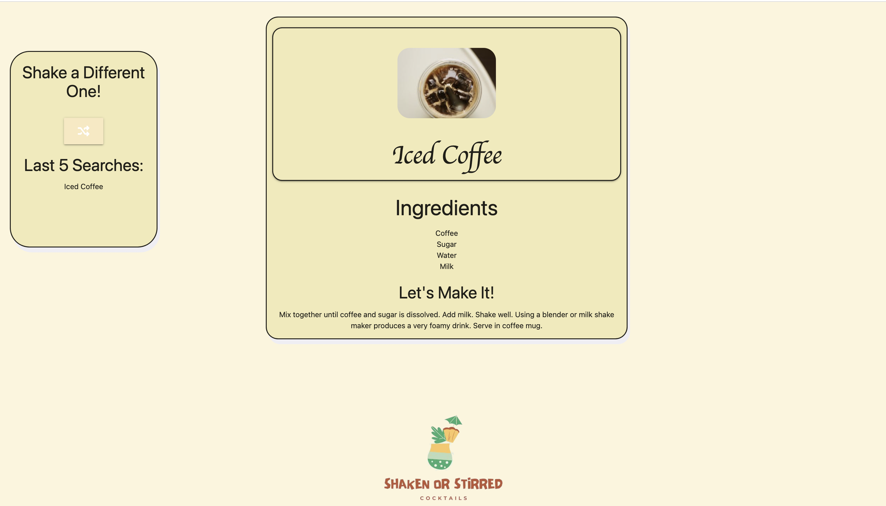
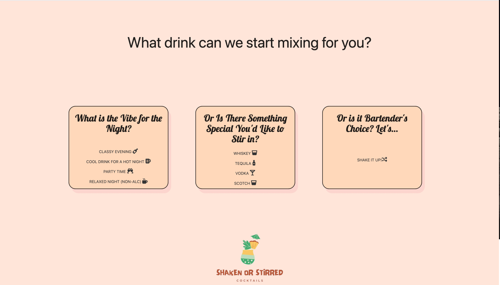

# Shaken Or Stirred
Developers: Michelle Shelton, Jelena Tomic, and Nermin Dracic
    

## Table of contents
* [General Info](#summary)
* [Installation](#installation)
* [Technologies](#Technologies)
* [Usage](#usage)

## Summary 

What are you drinking tonight? Don’t know? Shaken or Stirred has you covered! The site suggests cocktails for whatever kind of evening you want to have. The site will pull random cocktails and allows the user to get a more curated choice by specifying what kind of night they want to have, or what liquor they want to use (including none!). And if the user is under 21, it offers a fun mix of non-alcoholic drinks. Drink choice includes a photo of the drink and the drinks name, ingredients, and instructions to make it. 
#### What We Made
- Built an app that allows the user to get a 
- Built a Verification Page to verify users age. Leading them to the correct page whether they are 21 years or older.
- When age is verified the user will be prompted to choose the kind of night or drink they prefer for the evening, or for future reference!
- After an option is selected, the user is directed to a new page where a cocktail or mocktail will be displayed, along with ingredients and recipe.
- Previous drinks will be stored and displayed for user to refer to. 
- If the user happens to be younger than 21 non-alcoholics drinks would be displayed.

## Installation
From Git Hub repository, ShakenorStirred_Cocktails, click CODE box, select SSH and copy the repository to your clipboard.  In your command-line navigate to the folder you want to hold the repository.

[GitHub Repo](https://github.com/NWbootcamp/ShakenorStirred_Cocktails)

## Technologies

* HTML - Used to build the basic frame of the site including four HTML pages, input fields, buttons, lists, and text areas.
* CSS - Used to style the HTML including colors and layout.
* Materialize 1.0.0 - Additional CSS classes supplied for layout displays.
* Google Fonts - To pull unique fonts for website styling
* JavaScript - Used to create the site's functionality including calling API's, verifying the Users Birth Year, button functionality, changing pages, and filling in text areas using pulled data and local storage.
* Font Awesome - used to provide icons throughout the interphase.
* Unsplash - Used to find photo in background of landing page
* Canva - Used to create site logo

## APIs
* https://www.thecocktaildb.com/api.php
- Used multiple API calls including: Search cocktail by name, look up random cocktail, search by ingredient, filter by alcoholic, and filter by category

* https://timezonedb.com/api 
* https://www.pexels.com/api/

---

## How to Use?

* On the landing page, users are introduced to the abilities of the site and prompted to input their birth year. Once the year is inputed, the site compares the users age to the current year which is pulled from the TimeZoneDB API before directing the user to a new page

* If the user is under 21, they are directed to a page that displays a random non-alcoholic drink pulled from TheCocktailDB API including its name, ingredients, and instructions to make it. The page also shows a photo of the drink pulled from the Pexels API. Local storage is used to store past drink names which are then appended to the page. There is also a button that allows users to call new drinks.

* If the user is over 21, they are lead to a page that allows them to choose any random drink or a more curated list based on category of drink or type of liquor.

* Once the user has chosen an option, they are brought to a page that displays a random drink based on the user’s choices pulled from TheCocktailDB API including its name, photo, ingredients, and instructions to make it. Local storage is used to store past drink names which are then appended to the page. There is also buttons that allow users to call new drinks based on the same choices as the previous page.

---

### Working Agreement
How will your group handle disagreements?
- Vote with a 2 to 1 majority winning.
- Explore different ideas and express why they would/wouldn’t work
- Focus on what needs to happen to fulfill the project
When will you work?
- In class, after class, and on Saturdays. We may work Wed/Fri as is needed, we may also work individually as our individual calendars allow
How will you ensure everyone feels like they are included?
- Assign each of us a specific element to take the lead on.
- If needed, we will be splitting the code evenly based on what needs to be accomplished for that week to allow us to stay on schedule.